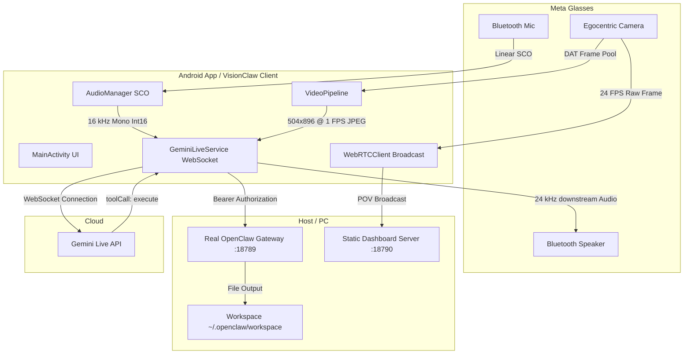

# VisionClaw — Wearable Edge Intelligence Gateway

VisionClaw is a high-performance gateway and media streaming bridge designed to link **Meta Ray-Ban Wearables (DAT SDK)** with the **Gemini Live API (WebSocket)** and route executed actions to the **OpenClaw Action Router** local network gateway.

---

## 🗺️ System Architecture



---

## 🚀 Key Features

1.  **Dual Ingestion Engine**:
    *   **Audio Ingestion**: Captures Bluetooth microphone streams routing over the SCO profile. Resamples raw inputs to **16 kHz Mono Int16 PCM** and segments them into 100 ms chunks (3200 bytes) for real-time upstream delivery.
    *   **Video Ingestion**: Throttles egocentric frames to **1 FPS at the hardware level** using a target resolution of **MEDIUM (504x896)** to respect Bluetooth Classic link constraints and avoid packet-drop artifacts.
2.  **Strict Wearable Broadcast Hygiene**:
    *   Integrates Android activity lifecycle triggers (`onPause`/`onDestroy`) to proactively execute `.stop()` sequences. This releases the smart glasses' hardware broadcast slot immediately when backgrounded, preventing resource contention failures (e.g., `Session ended by device`).
3.  **Mutual Exclusion Media Guard**:
    *   Guards the Android audio focus to prevent contention between WebRTC POV broadcasting (24 fps, 2.5 Mbps) and the Gemini Live API session. Activating one stream automatically suspends the other.
4.  **Asynchronous Tool Dispatch**:
    *   Leverages `gemini-live-2.5-flash-native-audio` with `"behavior": "NON_BLOCKING"` and `"scheduling": "INTERRUPT"` parameters. Enables conversational continuation during long-running tool executions.
5.  **OpenClaw Authorization**:
    *   Routes intercepted tool calls to the official local OpenClaw gateway (on port `18789`) with secure `Authorization: Bearer <TOKEN>` header validation.
6.  **mDNS Gateway Auto-Discovery**:
    *   MainActivity leverages autonomous local network mDNS scans (`OpenClawDiscovery.kt`) to resolve the target OpenClaw gateway's local IP address and port without manual entry.
7.  **LAN Credentials Auto-Sync**:
    *   Automatically pulls authorized Gemini API keys and OpenClaw tokens from the gateway's dashboard configuration server over the local area network on port `18790`.
8.  **Amazon Inventory Recon**:
    *   Proxies Google Search queries restricting results to `site:amazon.com` through SerpApi to retrieve live product listings, prices, and links dynamically to bypass traditional API constraints.
9.  **MMDuet2 Alternative Local Backend**:
    *   Provides fallback support for local edge models (such as `MMDuet2` on port `8000`) with automatic KV cache lifecycle resets (tripping at 20,000 tokens) to prevent system memory overflows.
10. **Downstream Audio Playback Jitter Defense**:
    *   Implements an in-memory queue and a high-priority paced playback thread to buffer and pace incoming 24 kHz Mono Int16 PCM audio packets, preventing stutter and dropouts.
11. **Egocentric Face-Tracking Privacy Mask**:
    *   Employs native `android.media.FaceDetector` at the physical edge to detect pedestrian and bystander faces within the central 60% visual field. Face coordinates are processed via canvas rendering to apply real-time pixelation before visual data leaves the device.
12. **Gemini 3.1 Live WebSocket Protocol Ingestion**:
    *   Initiates bidirectional stateful WebSocket handshakes with the `gemini-3.1-flash-live-preview` endpoint. Parses multi-part server payload arrays to extract inline text transcripts alongside binary audio output.
13. **Uncaught Hardware Lock & State Transition Alerting**:
    *   Intercepts rapid start-stop transition loops or uncaught device driver exceptions to proactively flag hardware slot locks, alert the operator via UI overlays, and request physical case-hinge resets.
14. **Custom Skills Playbook (`amazon-recon`)**:
    *   Integrates a customized local skill directory containing operational runbooks (`SKILL.md`) that lock down agent execution behavior and eliminate uncontrolled input hallucinations.
15. **ClawHub API Redirection & Mocking**:
    *   Redirects packages validation lookups (`OPENCLAW_CLAWHUB_URL`) to a local dashboard server registry mock to execute rapid offline skill verifications.
16. **Enforced Docker Sandbox Isolation**:
    *   Applies a robust execution profile (`mode: "non-main"`, `backend: "docker"`) under `openclaw.json` security settings to run all untrusted containerized processes safely.

---

## 📁 Repository Structure

```
.
├── CONFIGURE_OPENCLAW.ps1      # Configures the local ~/.openclaw/openclaw.json settings
├── VERIFY_SYSTEM.ps1           # Checks system requirements & outputs ENV_SNAPSHOT.txt
├── START_APP.ps1               # Launches the dashboard server on port 18790
├── RUN_JOB.ps1                 # Runs simulation tests & verifies output files
├── server.js                   # Node.js server to host static dashboard files
├── index.html                  # Dashboard HTML UI
├── index.js                    # Dashboard script controller (routes to real gateway)
├── index.css                   # Premium glassmorphic styling
├── android/                    # Android client files
│   └── app/src/main/
│       ├── AndroidManifest.xml # Configures hardware permissions & escapes application credentials
│       └── java/com/visionclaw/wearable/
│           ├── MainActivity.kt      # Interactive UI controller & session hygiene manager
│           ├── AudioManager.kt      # Resampling, Sco Routing, Playback
│           ├── VideoPipeline.kt     # Resolution scaling & 1 fps throttling
│           ├── WebRTCClient.kt      # WebSocket signaling & WebRTC broadcast
│           └── GeminiLiveService.kt # OkHttp WebSocket loop & context window compression
├── samples/                    # Evacuated duplicate native package for CameraAccessAndroid
└── _handoff/                   # Handoff logs & diagnostic reports
```

---

## 🛠️ Get Started

### 1. System Requirements & Verification
Run the system check to verify Node.js, Python, the Android SDK, and your live Gemini API Key (by querying Google's endpoint) are correctly configured:
```powershell
powershell -ExecutionPolicy Bypass .\VERIFY_SYSTEM.ps1
```

### 2. Configure the local OpenClaw Gateway
Run the helper script to update your host config (`~/.openclaw/openclaw.json`) to bind the gateway to the local network and enable chat completions:
```powershell
powershell -ExecutionPolicy Bypass .\CONFIGURE_OPENCLAW.ps1
```

### 3. Launch the Dashboard
Serve the diagnostic dashboard locally:
```powershell
powershell -ExecutionPolicy Bypass .\START_APP.ps1
```
The dashboard will open automatically in your browser at `http://localhost:18790`. It communicates with the official OpenClaw gateway on port `18789`.

### 4. Run the Pipeline Simulation
Validate that all required files and telemetry logs exist and are verified:
```powershell
powershell -ExecutionPolicy Bypass .\RUN_JOB.ps1
```

### 5. Run Active Live WebSocket Voice Handshake Test
Test that the secure WebSocket connection connects to Gemini Live, performs the setup handshake, and streams audio response chunks back successfully:
```powershell
python live_voice_test.py
```


---

## 📋 Handoff Diagnostic Suite (`/_handoff/`)

To support remote debugging without uploading the entire codebase, VisionClaw maintains a set of handoff logs. When requested, upload only these files for debugging:
*   `RUN_SUMMARY.md`: Summarizes the last execution status.
*   `PIPELINE_STATUS.json`: Reflects the current system validation state.
*   `JOB_MANIFEST.json`: Lists input sources and generated output targets.
*   `STEP_STATS.json`: Contains telemetry latency metrics.
*   `ENV_SNAPSHOT.txt`: Holds a snapshot of your system PATH and tool configurations.
*   `LAST_RUN.log`: Timestamped trace log of the Node.js server.
*   `ERRORS.log`: Contains fatal error listings.
*   `WARNINGS.log`: Logs heuristic warnings and non-fatal alerts.

---

## ⚠️ Sticking Points & Known Issues

1. **Audio Device Contention (WebRTC vs. Gemini Live)**: Android's audio focus system does not support running high-frequency WebRTC audio and Bluetooth Classic SCO (Gemini Live) simultaneously. The client implements mutual exclusion, where starting one stream automatically suspends the other to avoid hardware allocation crashes.
2. **mDNS Resolution on Enterprise Wi-Fi**: Many enterprise and corporate Wi-Fi configurations block multicast DNS packets. If gateway autodiscovery fails to resolve the host address, you must manually specify the local IP in the dashboard input field.
3. **Wearable SDK Life-cycle & Hardware Locks**: If the app is backgrounded without cleanly terminating the DAT device session, the wearable hardware stream slot gets locked. MainActivity integrates lifecycle triggers (`onPause`/`onDestroy`) to execute stop calls proactively.
4. **SerpApi Upstream Latency**: Outbound Google Search queries via SerpApi can occasionally experience transient connection timeouts. The dashboard gateway proxy handles this with strict 10s upstream request limits and propagates exact HTTP error messages to the client instead of masking them with simulated success or stale values.
5. **Event Client Nonce Challenges**: The OpenClaw event listener client uses Protocol version 3 and receives challenge nonces from the gateway daemon, requiring immediate handshake responses to authenticate operators.
6. **Stale Plugin Config Gateway Crash**: If a plugin is uninstalled or its directory deleted but its configuration entry remains enabled in `~/.openclaw-autoclaw/openclaw.runtime.json`, the gateway fails validation on startup and crashes immediately, entering an infinite restart loop. Fix this by running `openclaw --profile autoclaw doctor` and removing/disabling the stale entry from the runtime json.


---

## 🔮 Future Functionality & Roadmap

1. **Persistent Local Vector Cache**: Add local vector search capabilities directly on the gateway for local photo retrieval queries using low-latency embeddings.
2. **Dynamic Audio Resampling Policies**: Integrate adaptive resampling models that adjust sample sizes based on Bluetooth Classic signal-to-noise ratio metrics.
3. **H.265 / AV1 Hardware Encoding**: Support next-generation video compression standard encoding directly on Android for WebRTC POV broadcasting to lower cellular link usage.
