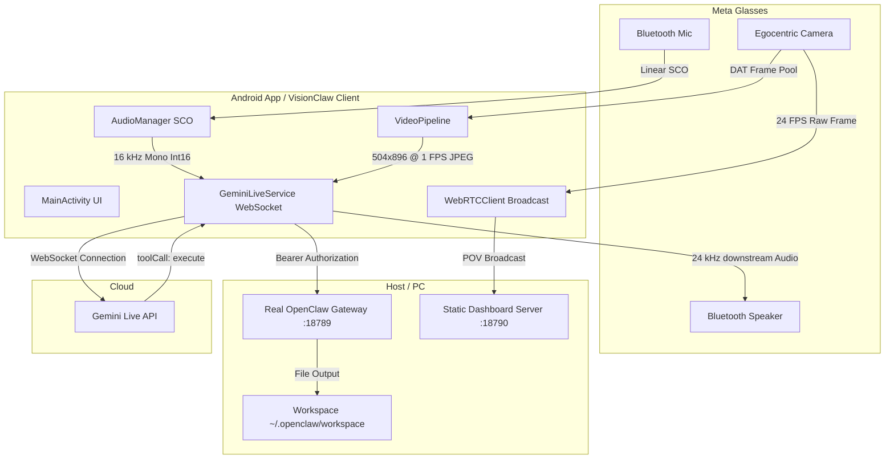

# VisionClaw — Wearable Edge Intelligence Gateway

VisionClaw is a high-performance gateway and media streaming bridge designed to link **Meta Ray-Ban Wearables (DAT SDK)** with the **Gemini Live API (WebSocket)** and route executed actions to the **OpenClaw Action Router** local network gateway.

---

## 🗺️ System Architecture



---

## 🚀 Key Features

1.  **Dual Ingestion Engine**:
    *   **Audio Ingestion**: Captures Bluetooth microphone streams routing over the SCO profile. Resamples raw inputs to **16 kHz Mono Int16 PCM** and segments them into 100 ms chunks (3200 bytes) for real-time upstream delivery.
    *   **Video Ingestion**: Throttles egocentric frames to **1 FPS at the hardware level** using a target resolution of **MEDIUM (504x896)** to respect Bluetooth Classic link constraints and avoid packet-drop artifacts.
2.  **Strict Wearable Broadcast Hygiene**:
    *   Integrates Android activity lifecycle triggers (`onPause`/`onDestroy`) to proactively execute `.stop()` sequences. This releases the smart glasses' hardware broadcast slot immediately when backgrounded, preventing resource contention failures (e.g., `Session ended by device`).
3.  **Mutual Exclusion Media Guard**:
    *   Guards the Android audio focus to prevent contention between WebRTC POV broadcasting (24 fps, 2.5 Mbps) and the Gemini Live API session. Activating one stream automatically suspends the other.
4.  **Asynchronous Tool Dispatch**:
    *   Leverages `gemini-live-2.5-flash-native-audio` with `"behavior": "NON_BLOCKING"` and `"scheduling": "INTERRUPT"` parameters. Enables conversational continuation during long-running tool executions.
5.  **OpenClaw Authorization**:
    *   Routes intercepted tool calls to the official local OpenClaw gateway (on port `18789`) with secure `Authorization: Bearer <TOKEN>` header validation.

---

## 📁 Repository Structure

```
.
├── CONFIGURE_OPENCLAW.ps1      # Configures the local ~/.openclaw/openclaw.json settings
├── VERIFY_SYSTEM.ps1           # Checks system requirements & outputs ENV_SNAPSHOT.txt
├── START_APP.ps1               # Launches the dashboard server on port 18790
├── RUN_JOB.ps1                 # Runs simulation tests & verifies output files
├── server.js                   # Node.js server to host static dashboard files
├── index.html                  # Dashboard HTML UI
├── index.js                    # Dashboard script controller (routes to real gateway)
├── index.css                   # Premium glassmorphic styling
├── android/                    # Android client files
│   └── app/src/main/
│       ├── AndroidManifest.xml # Configures hardware permissions & escapes application credentials
│       └── java/com/visionclaw/wearable/
│           ├── MainActivity.kt      # Interactive UI controller & session hygiene manager
│           ├── AudioManager.kt      # Resampling, Sco Routing, Playback
│           ├── VideoPipeline.kt     # Resolution scaling & 1 fps throttling
│           ├── WebRTCClient.kt      # WebSocket signaling & WebRTC broadcast
│           └── GeminiLiveService.kt # OkHttp WebSocket loop & context window compression
├── ios/                        # iOS client files (Ignored per user directive)
└── _handoff/                   # Handoff logs & diagnostic reports
```

---

## 🛠️ Get Started

### 1. System Requirements & Verification
Run the system check to verify Node.js, Python, and the Android SDK are correctly configured on your environment:
```powershell
powershell -ExecutionPolicy Bypass .\VERIFY_SYSTEM.ps1
```

### 2. Configure the local OpenClaw Gateway
Run the helper script to update your host config (`~/.openclaw/openclaw.json`) to bind the gateway to the local network and enable chat completions:
```powershell
powershell -ExecutionPolicy Bypass .\CONFIGURE_OPENCLAW.ps1
```

### 3. Launch the Dashboard
Serve the diagnostic dashboard locally:
```powershell
powershell -ExecutionPolicy Bypass .\START_APP.ps1
```
The dashboard will open automatically in your browser at `http://localhost:18790`. It communicates with the official OpenClaw gateway on port `18789`.

### 4. Run the Pipeline Simulation
Validate that all required files and telemetry logs exist and are verified:
```powershell
powershell -ExecutionPolicy Bypass .\RUN_JOB.ps1
```

---

## 📋 Handoff Diagnostic Suite (`/_handoff/`)

To support remote debugging without uploading the entire codebase, VisionClaw maintains a set of handoff logs. When requested, upload only these files for debugging:
*   `RUN_SUMMARY.md`: Summarizes the last execution status.
*   `PIPELINE_STATUS.json`: Reflects the current system validation state.
*   `JOB_MANIFEST.json`: Lists input sources and generated output targets.
*   `STEP_STATS.json`: Contains telemetry latency metrics.
*   `ENV_SNAPSHOT.txt`: Holds a snapshot of your system PATH and tool configurations.
*   `LAST_RUN.log`: Timestamped trace log of the Node.js server.
*   `ERRORS.log`: Contains fatal error listings.
*   `WARNINGS.log`: Logs heuristic warnings and non-fatal alerts.
